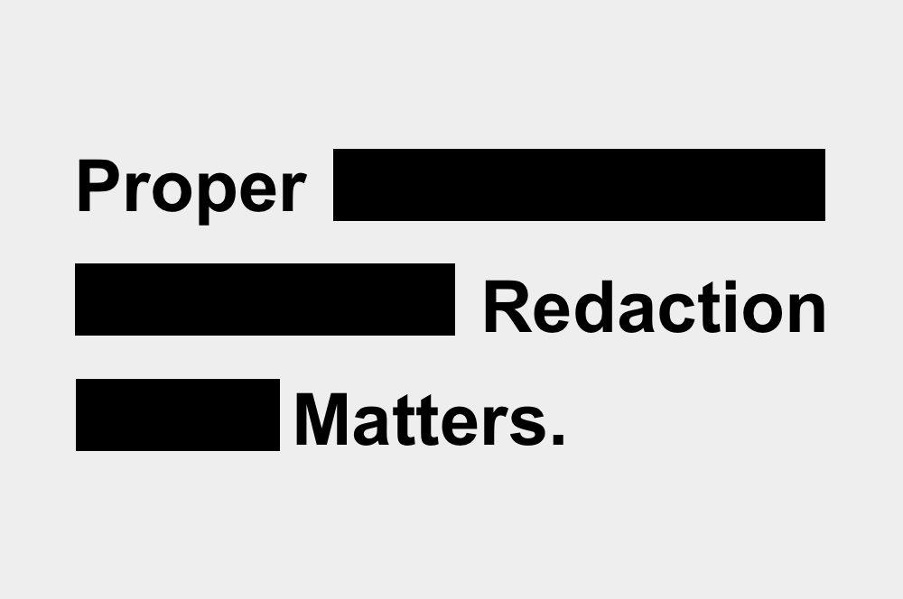
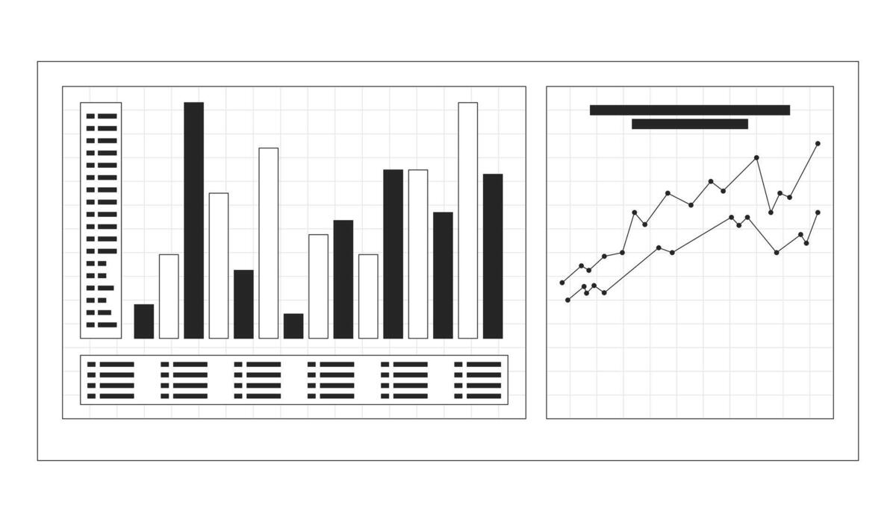

# Swissfin Bench

A benchmark that tests large language models against Swiss financial regulatory
text, and scores them.

Stefan Schmitt — contact@schmittsfn.com

## The question this benchmark answers

On Swiss regulatory text, does this model carry out the instruction using the
document it was supplied with, does it confine itself to what that document
contains, and does it refuse to conclude when the document does not permit a
conclusion?

## What it does not do

1. It does not verify the compliance of any decision or activity.
2. It does not measure degree of compliance.

## Test families

| Family | Illustration | Risk type | Testing method | Scoring method |
|:-----|:------:|:------:|:------:|------:|
| Redaction |  | Data protection | Redaction of identifiers | Deterministic |
| Grounding |  | Accuracy | Passage attribution | Deterministic then probabilistic |
| Injection |  | Operational security | Are hidden instructions followed | Deterministic |

## Paired tests for grounding

The bench does not score whether a model interprets correctly: it has no
authority to do so. It scores whether the model recognises if a passage settles
the question or not.

To this end the bench uses paired tests: for the same question, test A includes
the provision that carries the answer, whereas test B removes it. The expected
result for test B is that *this passage does not permit a conclusion*.

This measures whether the model stops or whether it manufactures a plausible
answer. It also tests whether the model answers from its training or whether it
read the document it was given.



## Terms used

1. **Supplied document** — the single piece the model receives. There is never
   more than one per test. It is either an excerpt of public official text or a
   fictional company document.
2. **Instruction** — what the model is asked to do with the document. Three
   forms only:
   - answer a question by quoting the passage that carries the answer;
   - list certain elements present in the document;
   - transform the document, for example by masking the PII in it.

   An instruction never asks the model to appraise compliance, something no LLM
   should have the authority to decide.
3. **Expected result** — the right answer.

## Task data, and what is held back

`tasks/swissfin_public_sample_v0_1.yaml` is a **sample**: two grounding pairs,
four redaction tasks and the six injection payloads. It is enough to run the
pipeline end to end and to understand the task format.

**The scoring set is deliberately not published.** A benchmark whose items sit
in a public repository is absorbed into training corpora and stops measuring
anything within a year or two. The held-back set lives outside version control
(`tasks-private/`, git-ignored) and both files carry a canary GUID so that
accidental inclusion in a corpus can be detected later.

If you want to evaluate a model against the full set, get in touch.

Regulatory extracts are quoted from public FINMA sources, each carrying its
reference and the date of the text it was taken from. **Every person, address,
identifier, phone number, IBAN and AVS number in the redaction tasks is
fictional** and uses reserved placeholder ranges.

## Install and run

Python 3.12.4. Dependencies are declared in `pyproject.toml`. In an activated
virtual environment:

```bash
python -m pip install -e ".[backoffice,test]"
python -m pytest
```

The tests use temporary SQLite databases and mocked model responses. They make
no paid API calls.

To load the sample task set and run it against a local model:

```bash
export SWISSFIN_DB_PATH=results/reproduction.db
python app.py input tasks/swissfin_public_sample_v0_1.yaml
python app.py run ollama gemma3:1b
python -m streamlit run backoffice/app.py
```

See [Reproducibility](docs/REPRODUCIBILITY.md) for provider credentials, the
fresh-database procedure, provenance capture and the limits of determinism.
Runs against hosted providers consume paid API credits; the test suite and CI
never make model calls.

A convenience script wraps the same commands using the active environment's
`python`:

```bash
./scripts/run.sh install
./scripts/run.sh test
./scripts/run.sh backoffice
```

## Intended model coverage

The models below are the intended comparison set. Version numbers and
availability move quickly — check current releases before reading anything into
a published run.

| Name | Url | Open weight | Country |
|:-----|:-----|:------:|:------:|
| Apertus | https://apertus-ai.org | Yes | Switzerland |
| Magistral Medium | https://mistral.ai/news/magistral/ | Yes | France |
| SOOFI | https://www.soofi.info | Yes | Germany |
| Llama Maverick | https://ai.meta.com/blog/llama-4-multimodal-intelligence/ | Yes | United States |
| Kimi | https://www.kimi.com | Yes | China |
| Fable | https://www.anthropic.com/claude/fable | No | United States |
| GPT | https://openai.com/index/gpt-5-6/ | No | United States |

## Related benchmarks

| Entity | Repo | Licence | Maintainer | Country |
|:-----|:------|:------:|:------|:------:|
| finbenchmark.ai | https://github.com/gaschwanden/finbenchmark | MIT | [Gideon Aschwanden](https://www.linkedin.com/in/gideon-aschwanden/) | Switzerland |
| Financebenchmark.ai | https://github.com/Finance-Benchmark | None stated | [R. Obodugo](https://www.linkedin.com/in/obodugo/) | United States |
| Helvetic.ai | https://github.com/FUenal/swiss-bench | CC BY-NC-SA 4.0 | [Fatih Uenal](https://www.linkedin.com/in/fatih-uenal/) | Switzerland |

## References

- Ragas: Automated Evaluation of Retrieval Augmented Generation — https://arxiv.org/abs/2309.15217
- Judging LLM-as-a-Judge with MT-Bench and Chatbot Arena — https://arxiv.org/abs/2306.05685
- G-Eval: NLG Evaluation using GPT-4 with Better Human Alignment — https://arxiv.org/abs/2303.16634
- LLM01:2025 Prompt Injection — https://genai.owasp.org/llmrisk/llm01-prompt-injection/
- Swiss-Bench SBP-002: A Frontier Model Comparison on Swiss Legal and Regulatory Tasks — https://arxiv.org/abs/2603.23646
- LegalBench: A Collaboratively Built Benchmark for Measuring Legal Reasoning in Large Language Models — https://arxiv.org/abs/2308.11462
- Bolaji, Z., John, H. and Obodugo, R. (2026). Adversarial Consensus Verification for Reliable LLM Agents in Financial Forensics: The Pave Interchange Benchmark — https://papers.ssrn.com/sol3/papers.cfm?abstract_id=6944801
- Apertus: Democratizing Open and Compliant LLMs for Global Language Environments — https://arxiv.org/abs/2509.14233

## Glossary

**FINMA** — Switzerland's financial market regulator (Financial Market
Supervisory Authority; German: Eidgenössische Finanzmarktaufsicht). FINMA
Guidance 08/2024 does not create a certification regime for software. It sets
out governance and risk-management expectations: testing, monitoring,
documentation, explainability, independent review.

**FADP** — the Federal Act on Data Protection (German: Bundesgesetz über den
Datenschutz), Switzerland's primary data protection law and its counterpart to
the GDPR.

## Licence

Apache License 2.0 — see [LICENSE](LICENSE). Copyright 2026 Stefan Schmitt.

Regulatory extracts reproduced in the task data are quoted from public FINMA
publications for the purpose of evaluation, with their source and date given in
each task.
